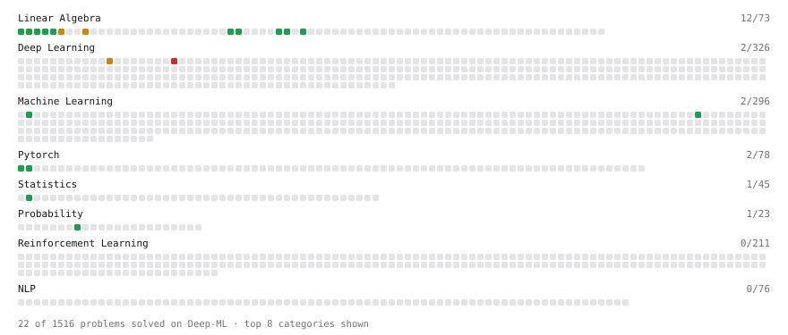

# Deep-ML

My machine learning practice from [Deep-ML](https://www.deep-ml.com). Every solution here was written by hand.

**35** solved · 22 problems · 0 labs · 13 math

[**Browse the interactive portfolio**](https://daniel3200u.github.io/deep-ml/) to replay this filling in over time.

## Problems

| | Difficulty | Solved | |
| --- | --- | --- | --- |
| [Calculate Cosine Similarity Between Vectors](https://www.deep-ml.com/problems/76) | easy | 2026-10-09 | [solution](problems/0076-calculate-cosine-similarity-between-vectors) |
| [Calculate Mean by Row or Column](https://www.deep-ml.com/problems/4) | easy | 2026-10-09 | [solution](problems/0004-calculate-mean-by-row-or-column) |
| [Create a Float Tensor from a Python List](https://www.deep-ml.com/problems/880) | easy | 2026-10-09 | [solution](problems/0880-create-a-float-tensor-from-a-python-list) |
| [Derivative of a Polynomial](https://www.deep-ml.com/problems/116) | easy | 2026-10-09 | [solution](problems/0116-derivative-of-a-polynomial) |
| [Descriptive Statistics Calculator](https://www.deep-ml.com/problems/78) | easy | 2026-10-10 | [solution](problems/0078-descriptive-statistics-calculator) |
| [Dot Product Calculator](https://www.deep-ml.com/problems/83) | easy | 2026-10-09 | [solution](problems/0083-dot-product-calculator) |
| [Expected Value and Variance of an n-Sided Die](https://www.deep-ml.com/problems/179) | easy | 2026-10-10 | [solution](problems/0179-expected-value-and-variance-of-an-n-sided-die) |
| [Gradient Direction and Magnitude](https://www.deep-ml.com/problems/308) | easy | 2026-10-09 | [solution](problems/0308-gradient-direction-and-magnitude) |
| [Linear Regression Using Gradient Descent](https://www.deep-ml.com/problems/15) | easy | 2026-10-10 | [solution](problems/0015-linear-regression-using-gradient-descent) |
| [Matrix Determinant & Trace](https://www.deep-ml.com/problems/195) | easy | 2026-10-09 | [solution](problems/0195-matrix-determinant-trace) |
| [Matrix-Vector Dot Product](https://www.deep-ml.com/problems/1) | easy | 2026-10-09 | [solution](problems/0001-matrix-vector-dot-product) |
| [Reshape and Transpose a Tensor](https://www.deep-ml.com/problems/881) | easy | 2026-10-09 | [solution](problems/0881-reshape-and-transpose-a-tensor) |
| [Reshape Matrix](https://www.deep-ml.com/problems/3) | easy | 2026-10-09 | [solution](problems/0003-reshape-matrix) |
| [Scalar Multiplication of a Matrix](https://www.deep-ml.com/problems/5) | easy | 2026-10-09 | [solution](problems/0005-scalar-multiplication-of-a-matrix) |
| [Transpose of a Matrix](https://www.deep-ml.com/problems/2) | easy | 2026-10-09 | [solution](problems/0002-transpose-of-a-matrix) |
| [Vector Element-wise Sum](https://www.deep-ml.com/problems/121) | easy | 2026-10-09 | [solution](problems/0121-vector-element-wise-sum) |
| [Vector Norms (L1/L2/L-inf) and the Frobenius Norm](https://www.deep-ml.com/problems/328) | easy | 2026-10-09 | [solution](problems/0328-vector-norms-l1-l2-l-inf-and-the-frobenius-norm) |
| [Calculate Eigenvalues of a Matrix](https://www.deep-ml.com/problems/6) | medium | 2026-10-10 | [solution](problems/0006-calculate-eigenvalues-of-a-matrix) |
| [Implement Self-Attention Mechanism](https://www.deep-ml.com/problems/53) | medium | 2026-10-10 | [solution](problems/0053-implement-self-attention-mechanism) |
| [Matrix times Matrix ](https://www.deep-ml.com/problems/9) | medium | 2026-10-09 | [solution](problems/0009-matrix-times-matrix) |
| [Quotient Rule for Derivatives](https://www.deep-ml.com/problems/312) | medium | 2026-10-09 | [solution](problems/0312-quotient-rule-for-derivatives) |
| [Implement Multi-Head Attention](https://www.deep-ml.com/problems/94) | hard | 2026-10-10 | [solution](problems/0094-implement-multi-head-attention) |

## Math

| | Difficulty | Solved | |
| --- | --- | --- | --- |
| [Derivatives and Gradients](https://www.deep-ml.com/math-problems/1) | easy | 2026-10-09 | [solution](math/0001-derivatives-and-gradients) |
| [Descriptive Statistics](https://www.deep-ml.com/math-problems/18) | easy | 2026-10-10 | [solution](math/0018-descriptive-statistics) |
| [Expectation and Variance Algebra](https://www.deep-ml.com/math-problems/33) | easy | 2026-10-10 | [solution](math/0033-expectation-and-variance-algebra) |
| [Gradient Descent Updates](https://www.deep-ml.com/math-problems/5) | easy | 2026-10-09 | [solution](math/0005-gradient-descent-updates) |
| [Matrix Basics](https://www.deep-ml.com/math-problems/9) | easy | 2026-10-09 | [solution](math/0009-matrix-basics) |
| [Probability Fundamentals](https://www.deep-ml.com/math-problems/19) | easy | 2026-10-10 | [solution](math/0019-probability-fundamentals) |
| [Vector Operations](https://www.deep-ml.com/math-problems/7) | easy | 2026-10-09 | [solution](math/0007-vector-operations) |
| [Determinants and Trace](https://www.deep-ml.com/math-problems/11) | medium | 2026-10-09 | [solution](math/0011-determinants-and-trace) |
| [Inverse and Rank](https://www.deep-ml.com/math-problems/12) | medium | 2026-10-09 | [solution](math/0012-inverse-and-rank) |
| [Matrix Multiplication](https://www.deep-ml.com/math-problems/10) | medium | 2026-10-09 | [solution](math/0010-matrix-multiplication) |
| [Orthogonality and Projections](https://www.deep-ml.com/math-problems/14) | medium | 2026-10-10 | [solution](math/0014-orthogonality-and-projections) |
| [Solving Linear Systems](https://www.deep-ml.com/math-problems/13) | medium | 2026-10-09 | [solution](math/0013-solving-linear-systems) |
| [Vector Norms and Linear Independence](https://www.deep-ml.com/math-problems/8) | medium | 2026-10-09 | [solution](math/0008-vector-norms-and-linear-independence) |

---

_This file is regenerated by Deep-ML on every push._
